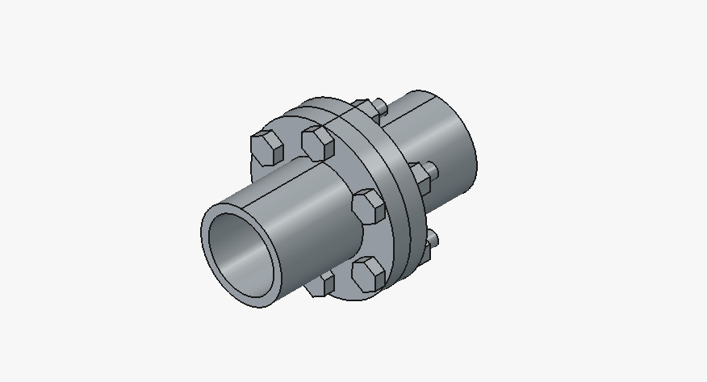

# FreeCAD Flange Coupling Assembly — GD&T

A parametric flange coupling assembly modeled in FreeCAD, built to
demonstrate parametric CAD modeling, assembly design, and Geometric
Dimensioning and Tolerancing (GD&T) per ASME Y14.5.



## Overview

The assembly consists of two mating flanges, six bolts, and six nuts,
connected via a register (spigot/recess) fit and a 6-hole bolt
circle pattern. Dimensions are adapted from a published rigid flange
coupling reference design.

**Components:**
- 2× Flange (⌀220mm OD, ⌀100mm register bore, 6× bolt holes on a
  192mm PCD)
- 6× Hex bolt
- 6× Hex nut

Modeled using FreeCAD's PartDesign workbench (sketch-driven
revolve/pad features, polar hole pattern) and Assembly workbench.

## Exploded view


## GD&T (ASME Y14.5)

The flange drawing applies three geometric tolerance callouts
against two datums, reflecting how the part actually functions in
assembly rather than tolerancing every dimension uniformly.

**Datums:**
- **Datum A** — the flange's central bore axis (primary reference;
  the coupling's core function is keeping two shafts coaxial)
- **Datum B** — the flange's back mating face

**Callouts:**

| Feature | Symbol | Tolerance | Reasoning |
|---|---|---|---|
| Bolt-hole pattern (6×) | Position ⌖ | ⌀0.5 Ⓜ A | Clearance holes — tolerance relaxes as hole size grows from its minimum (MMC), matching how bolted joints actually behave |
| Register / spigot fit | Position ⌖ | ⌀0.1 A | Tight, RFS (no MMC relief) — this is the critical fit controlling shaft-to-shaft alignment between the two flanges |
| Back face | Perpendicularity ⊥ | 0.05 A | Ensures the flange face sits square to the bore axis, preventing a tilted/misaligned assembly |


## Feature tree

Clean, named PartDesign feature history (sketch → revolve → hole →
polar pattern) for the flange body.


## Files

```
freecad-flange-coupling/
├── FlangeCoupling.FCStd      # Native FreeCAD document
├── step/
│   ├── flange.step
│   ├── bolt.step
│   ├── nut.step
│   └── assembly.step
├── drawings/
│   └── flange_gdt_drawing.pdf
└── images/
    ├── 01_assembly_isometric.png
    ├── 02_assembly_exploded.png
    ├── 03_flange_drawing_gdt.png
    └── 04_feature_tree.png
```

## Notes

- Bolt-hole diameter was adjusted to ⌀22mm from the original
  reference design's ⌀20mm during modeling; all other dimensions
  follow the source reference.
- Fasteners were positioned individually using placement/mates rather
  than a patterned array component.
- Built and tested in FreeCAD 1.1.1.

## Related project

See also: [freecad-bracket-generator](../freecad-bracket-generator) —
a Python-scripted parametric part-family generator, demonstrating
CAD automation in FreeCAD.
